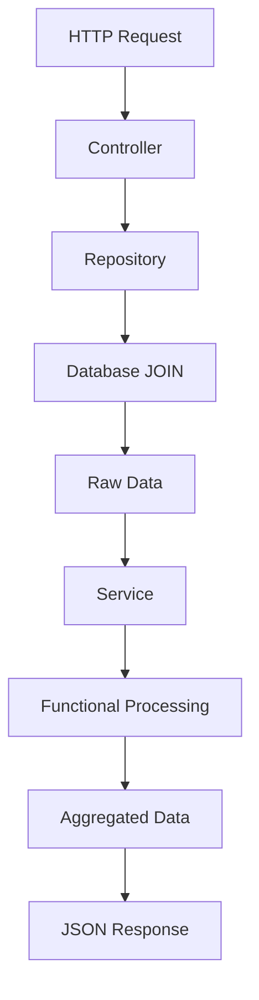

# 🏗️ EasyImob - Arquitetura de Software

## 📋 Índice

- [Visão Geral](#-visão-geral)
- [Princípios Arquiteturais](#-princípios-arquiteturais)
- [Estrutura de Camadas](#-estrutura-de-camadas)
- [Fluxo de Dados](#-fluxo-de-dados)
- [Padrões Implementados](#-padrões-implementados)
- [Decisões Técnicas](#-decisões-técnicas)

## 🎯 Visão Geral

**EasyImob** é um sistema backend HTTP/REST desenvolvido em **Node.js + TypeScript** para análise de dados imobiliários, seguindo os princípios de **Clean Architecture** e **programação funcional**.

### Contexto Acadêmico
- **Instituição**: UNIVALI
- **Disciplina**: Hands On Work VII
- **Objetivo**: Implementar analytics imobiliários sem agregações SQL (WHERE/GROUP BY)
- **Paradigma**: Processamento em memória com map/filter/reduce

## 🎨 Princípios Arquiteturais

### 1. Clean Architecture (Hexagonal)
```
┌─────────────────────────────────────────┐
│             Controllers                 │ ← HTTP Layer
├─────────────────────────────────────────┤
│              Services                   │ ← Business Logic
├─────────────────────────────────────────┤
│            Repositories                 │ ← Data Access
├─────────────────────────────────────────┤
│             Database                    │ ← Infrastructure
└─────────────────────────────────────────┘
```

### 2. Separation of Concerns
- **Controllers**: Apenas HTTP handlers
- **Services**: Lógica de negócio pura (functional programming)
- **Repositories**: Acesso a dados (apenas SELECT JOIN)
- **Types**: Contratos e interfaces

### 3. Dependency Injection
- Inversão de controle
- Testabilidade
- Baixo acoplamento

## 📁 Estrutura de Camadas

### 🌐 Presentation Layer (`src/controllers/`)
```typescript
// Responsabilidade: HTTP Request/Response handling
export class AnalyticsController {
  async getPaymentsByProperty(req: Request, res: Response): Promise<void> {
    const data = await this.repository.getAllPaymentsData();
    const result = this.service.calculatePaymentsByProperty(data);
    res.json(result);
  }
}
```

### 🧠 Business Layer (`src/services/`)
```typescript
// Responsabilidade: Pure functional programming
export class AnalyticsService {
  calculatePaymentsByProperty(data: PaymentData[]): PaymentsByPropertyItem[] {
    return data.reduce((acc, payment) => {
      // Functional aggregation logic
    }, {} as Record<number, PaymentsByPropertyItem>);
  }
}
```

### 💾 Data Layer (`src/repositories/`)
```typescript
// Responsabilidade: Single JOIN query, no WHERE/GROUP BY
export class PaymentsRepository {
  async getAllPaymentsData(): Promise<PaymentData[]> {
    const query = `
      SELECT vp.id_venda, vp.data_do_pagamento, vp.valor_do_pagamento,
             vp.codigo_imovel, i.descricao_imovel, ti.nome as tipo_imovel
      FROM venda_pagamento vp
      JOIN imovel i ON vp.codigo_imovel = i.codigo_imovel
      JOIN tipo_imovel ti ON i.id_tipo = ti.id_tipo
    `;
    // Return raw data for in-memory processing
  }
}
```

## 🔄 Fluxo de Dados



### Exemplo Completo: `/analytics/payments-by-property`

1. **HTTP**: `GET /analytics/payments-by-property`
2. **Controller**: `AnalyticsController.getPaymentsByProperty()`
3. **Repository**: `PaymentsRepository.getAllPaymentsData()`
4. **SQL**: Single JOIN (6 columns)
5. **Service**: `AnalyticsService.calculatePaymentsByProperty()`
6. **Processing**: `data.reduce()` para agrupar por imóvel
7. **Response**: JSON ordenado por valor total

## 🔧 Padrões Implementados

### 1. Repository Pattern
- Encapsulamento de acesso a dados
- Single responsibility (apenas JOIN)
- Interface consistente

### 2. Factory Pattern
```typescript
export const createAnalyticsController = (
  repository: PaymentsRepository,
  service: AnalyticsService
): AnalyticsController => {
  return new AnalyticsController(repository, service);
};
```

### 3. Functional Programming
```typescript
// Pure functions - sem side effects
const calculatePercentages = (data: PaymentData[]): SalesShareByTypeItem[] =>
  Object.entries(countByType)
    .map(([tipo_imovel, quantidade]) => ({
      tipo_imovel,
      percentual: roundToTwoDecimals((quantidade / total) * 100),
      quantidade,
    }))
    .sort((a, b) => b.percentual - a.percentual);
```

### 4. Immutable Data Structures
- Todas as transformações retornam novos objetos
- Estado não é mutado
- Predicibilidade e testabilidade

## 📊 Endpoints e Responsabilidades

| Endpoint | Controller | Service | Repository | Processing |
|----------|------------|---------|------------|------------|
| `GET /health` | HealthController | - | healthCheck() | - |
| `GET /raw/payments` | AnalyticsController | - | getAllPaymentsData() | - |
| `GET /analytics/payments-by-property` | AnalyticsController | calculatePaymentsByProperty() | getAllPaymentsData() | reduce() |
| `GET /analytics/sales-by-month` | AnalyticsController | calculateSalesByMonth() | getAllPaymentsData() | reduce() + map() |
| `GET /analytics/sales-share-by-type` | AnalyticsController | calculateSalesShareByType() | getAllPaymentsData() | reduce() + map() |

## 🎯 Decisões Técnicas

### Por que TypeScript?
- **Type Safety**: Prevenção de erros em tempo de compilação
- **IntelliSense**: Melhor developer experience
- **Refactoring**: Segurança em mudanças de código
- **Documentation**: Tipos servem como documentação viva

### Por que Clean Architecture?
- **Testabilidade**: Cada camada pode ser testada isoladamente
- **Manutenibilidade**: Mudanças em uma camada não afetam outras
- **Escalabilidade**: Fácil adição de novas features
- **Flexibilidade**: Troca de database/framework sem impacto

### Por que Programação Funcional?
- **Predicibilidade**: Funções puras sempre retornam o mesmo resultado
- **Testabilidade**: Sem side effects, testes são mais simples
- **Paralelização**: Operações podem ser paralelizadas facilmente
- **Conformidade**: Atende requisito do HOW VII

### Por que Single JOIN Query?
- **Performance**: Uma única consulta ao banco
- **Simplicidade**: Lógica de agregação no código
- **Flexibilidade**: Múltiplas análises dos mesmos dados
- **Conformidade**: Atende restrição do enunciado

## 🔍 Pontos de Extensão

### Novos Analytics
```typescript
// 1. Adicionar método no AnalyticsService
calculateNewMetric(data: PaymentData[]): NewMetricItem[] {
  return data
    .filter(/* criteria */)
    .map(/* transformation */)
    .reduce(/* aggregation */, {});
}

// 2. Adicionar endpoint no AnalyticsController
async getNewMetric(req: Request, res: Response): Promise<void> {
  const data = await this.repository.getAllPaymentsData();
  const result = this.service.calculateNewMetric(data);
  res.json(result);
}

// 3. Registrar rota
router.get('/analytics/new-metric', controller.getNewMetric);
```

### Novos Dados
```typescript
// 1. Estender PaymentData interface
export interface ExtendedPaymentData extends PaymentData {
  novo_campo: string;
}

// 2. Atualizar query SQL
const query = `
  SELECT /* existing columns */, nova_tabela.novo_campo
  FROM /* existing joins */
  JOIN nova_tabela ON /* condition */
`;
```

## 🧪 Estratégia de Testes

### Unit Tests
- **Services**: Testam lógica de negócio pura
- **Input**: Dados sintéticos
- **Output**: Resultados esperados
- **Coverage**: 100% das funções de cálculo

### Integration Tests
- **Controllers**: Testam endpoints completos
- **Mocks**: Repository com dados controlados
- **Assertions**: Estrutura JSON e códigos HTTP
- **Scenarios**: Success cases e error handling

## 📚 Referências Arquiteturais

- **Clean Architecture**: Robert C. Martin
- **Functional Programming**: JavaScript Allongé
- **Repository Pattern**: Martin Fowler
- **Dependency Injection**: SOLID Principles
- **RESTful APIs**: Roy Fielding
- **TypeScript Best Practices**: Microsoft Documentation
